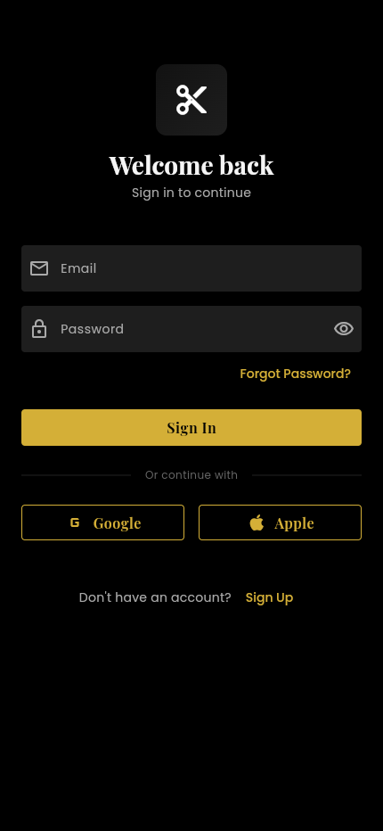

<p align="center">
  
</p>

<h1 align="center">Fade</h1>

<p align="center">
  <strong>The modern platform connecting clients with barbers</strong>
</p>

<p align="center">
  <a href="#features">Features</a> •
  <a href="#screenshots">Screenshots</a> •
  <a href="#tech-stack">Tech Stack</a> •
  <a href="#architecture">Architecture</a> •
  <a href="#getting-started">Getting Started</a> •
  <a href="#roadmap">Roadmap</a>
</p>

<p align="center">
  
  
  
  
</p>

---

## Overview

**Fade** is a full-stack mobile application that revolutionizes how clients discover and book appointments with barbers. Built with Flutter for cross-platform deployment, Fade provides a seamless experience for both clients seeking their next haircut and barbers managing their business.

The platform supports two distinct user experiences:
- **Clients**: Discover nearby barbers, browse portfolios, book appointments, and leave reviews
- **Barbers**: Manage schedules, showcase work, track earnings, and grow their client base

### Why Fade?

The barbershop industry lacks a modern, unified booking platform. Most barbers rely on phone calls, walk-ins, or fragmented social media DMs. Fade solves this by providing:

- **For Clients**: One app to find, evaluate, and book any barber
- **For Barbers**: A professional tool to manage their entire business
- **For Shop Owners**: Analytics and team management (coming soon)

---

## Features

### Client Experience

| Feature | Description |
|---------|-------------|
| **Smart Discovery** | Find barbers by location, rating, specialty, or availability |
| **Rich Profiles** | View portfolios, reviews, services, and pricing before booking |
| **Instant Booking** | Book appointments with real-time availability |
| **Style Feed** | TikTok-style feed of haircuts for inspiration |
| **Favorites** | Save preferred barbers for quick rebooking |
| **Review System** | Rate and review after appointments |

### Barber Experience

| Feature | Description |
|---------|-------------|
| **Dashboard** | Overview of upcoming appointments and earnings |
| **Calendar Management** | Set availability and manage bookings |
| **Content Studio** | Upload portfolio images and videos |
| **Service Management** | Create and price custom services |
| **Earnings Tracker** | Monitor revenue and payment history |
| **Stripe Connect** | Secure payment processing integration |

### Platform Features

- **Dual-Role System**: Seamlessly switch between client and barber modes
- **Real-time Notifications**: Instant updates for bookings and changes
- **OAuth Authentication**: Sign in with Google or Apple
- **Offline Support**: Cached data for unreliable connections
- **Dark Theme**: Modern UI with glassmorphism design

---

## Screenshots

<p align="center">
  
  
  
  
</p>

---

## Tech Stack

### Frontend
- **Framework**: Flutter 3.x (iOS, Android, Web)
- **State Management**: Riverpod with code generation
- **Navigation**: GoRouter for declarative routing
- **UI**: Custom design system with glassmorphism effects

### Backend
- **Database**: Supabase (PostgreSQL)
- **Authentication**: Supabase Auth (Email, Google, Apple OAuth)
- **Storage**: Supabase Storage for media assets
- **Real-time**: Supabase Realtime for live updates

### Integrations
- **Payments**: Stripe Connect for marketplace payments
- **Maps**: Google Maps SDK for location services
- **Media**: Video compression and image optimization

### DevOps
- **Version Control**: Git with conventional commits
- **CI/CD**: GitHub Actions (planned)
- **Analytics**: Firebase Analytics (planned)

---

## Architecture

```
lib/
├── config/                 # App configuration
│   ├── constants.dart      # Environment variables & constants
│   ├── routes.dart         # Route definitions
│   └── theme.dart          # Design system & theming
│
├── models/                 # Data models
│   ├── user.dart           # User & profile models
│   ├── barber.dart         # Barber, shop, service models
│   ├── appointment.dart    # Booking models
│   └── review.dart         # Review & rating models
│
├── providers/              # State management (Riverpod)
│   ├── auth_provider.dart  # Authentication state
│   ├── barber_provider.dart# Barber data & queries
│   ├── appointment_provider.dart
│   └── ...
│
├── screens/                # UI screens
│   ├── auth/               # Login, register, onboarding
│   ├── client/             # Client-facing screens
│   │   ├── home_screen.dart
│   │   ├── search_screen.dart
│   │   ├── booking_screen.dart
│   │   └── ...
│   └── barber/             # Barber dashboard screens
│       ├── dashboard_screen.dart
│       ├── calendar_screen.dart
│       ├── earnings_screen.dart
│       └── ...
│
└── services/               # External service integrations
    ├── supabase_service.dart
    └── google_places_service.dart
```

### Design Patterns

- **Repository Pattern**: Data layer abstraction via services
- **Provider Pattern**: Reactive state management with Riverpod
- **Feature-First Structure**: Screens organized by user role
- **Composition over Inheritance**: Reusable widget components

---

## Getting Started

### Prerequisites

- Flutter SDK 3.10+
- Dart SDK 3.0+
- Supabase account
- Google Maps API key
- Stripe account (for payments)

### Installation

1. **Clone the repository**
   ```bash
   git clone https://github.com/akashp3128/fade-app.git
   cd fade-app
   ```

2. **Install dependencies**
   ```bash
   flutter pub get
   ```

3. **Configure environment**
   ```bash
   cp .env.example .env
   # Edit .env with your API keys
   ```

4. **Set up Supabase**
   - Create a new Supabase project
   - Run the SQL migrations in `supabase_setup.sql`
   - Configure storage buckets (see `SUPABASE_SETUP.md`)

5. **Run the app**
   ```bash
   flutter run \
     --dart-define=SUPABASE_URL=your-url \
     --dart-define=SUPABASE_ANON_KEY=your-key \
     --dart-define=GOOGLE_MAPS_API_KEY=your-key
   ```

### IDE Setup (Recommended)

**VS Code** - Add to `.vscode/launch.json`:
```json
{
  "configurations": [
    {
      "name": "Fade App",
      "request": "launch",
      "type": "dart",
      "args": [
        "--dart-define=SUPABASE_URL=your-url",
        "--dart-define=SUPABASE_ANON_KEY=your-key",
        "--dart-define=GOOGLE_MAPS_API_KEY=your-key"
      ]
    }
  ]
}
```

---

## Database Schema

```
┌─────────────────┐       ┌─────────────────┐
│    profiles     │       │     shops       │
│─────────────────│       │─────────────────│
│ id (PK)         │       │ id (PK)         │
│ email           │       │ name            │
│ full_name       │       │ address         │
│ avatar_url      │       │ latitude        │
│ user_type       │       │ longitude       │
└────────┬────────┘       └────────┬────────┘
         │                         │
         │ 1:1                     │ 1:N
         ▼                         ▼
┌─────────────────┐       ┌─────────────────┐
│ barber_profiles │◄──────│    services     │
│─────────────────│       │─────────────────│
│ id (PK)         │       │ id (PK)         │
│ user_id (FK)    │       │ barber_id (FK)  │
│ shop_id (FK)    │       │ name            │
│ bio             │       │ price           │
│ rating          │       │ duration        │
│ specialties[]   │       └─────────────────┘
└────────┬────────┘
         │
         │ 1:N
         ▼
┌─────────────────┐       ┌─────────────────┐
│  appointments   │       │    reviews      │
│─────────────────│       │─────────────────│
│ id (PK)         │       │ id (PK)         │
│ client_id (FK)  │       │ barber_id (FK)  │
│ barber_id (FK)  │       │ client_id (FK)  │
│ service_id (FK) │       │ rating          │
│ scheduled_at    │       │ comment         │
│ status          │       │ created_at      │
└─────────────────┘       └─────────────────┘
```

---

## Roadmap

### Phase 1: Foundation ✅
- [x] User authentication (Email, Google, Apple)
- [x] Client home screen with barber discovery
- [x] Barber profiles with services and reviews
- [x] Appointment booking flow
- [x] Barber dashboard with calendar

### Phase 2: Growth 🚧
- [x] Stripe Connect payment integration
- [x] Content studio for barbers
- [ ] Push notifications
- [ ] Shop/team management
- [ ] Advanced search filters

### Phase 3: Scale 📋
- [ ] AI-powered style recommendations
- [ ] Natural language booking ("I need a cut Friday evening")
- [ ] Loyalty program & rewards
- [ ] Shop owner analytics dashboard
- [ ] Multi-language support

### Phase 4: Monetization 📋
- [ ] Premium barber subscriptions
- [ ] Featured placement ads
- [ ] Transaction fee model
- [ ] Enterprise shop packages

---

## Contributing

Contributions are welcome! Please read our contributing guidelines before submitting PRs.

1. Fork the repository
2. Create a feature branch (`git checkout -b feature/amazing-feature`)
3. Commit changes (`git commit -m 'Add amazing feature'`)
4. Push to branch (`git push origin feature/amazing-feature`)
5. Open a Pull Request

---

## License

This project is proprietary software. All rights reserved.

---

## Contact

**Akash Patel** - [@akashp3128](https://github.com/akashp3128)

Project Link: [https://github.com/akashp3128/fade-app](https://github.com/akashp3128/fade-app)

---

<p align="center">
  <sub>Built with ☕ and Flutter</sub>
</p>
